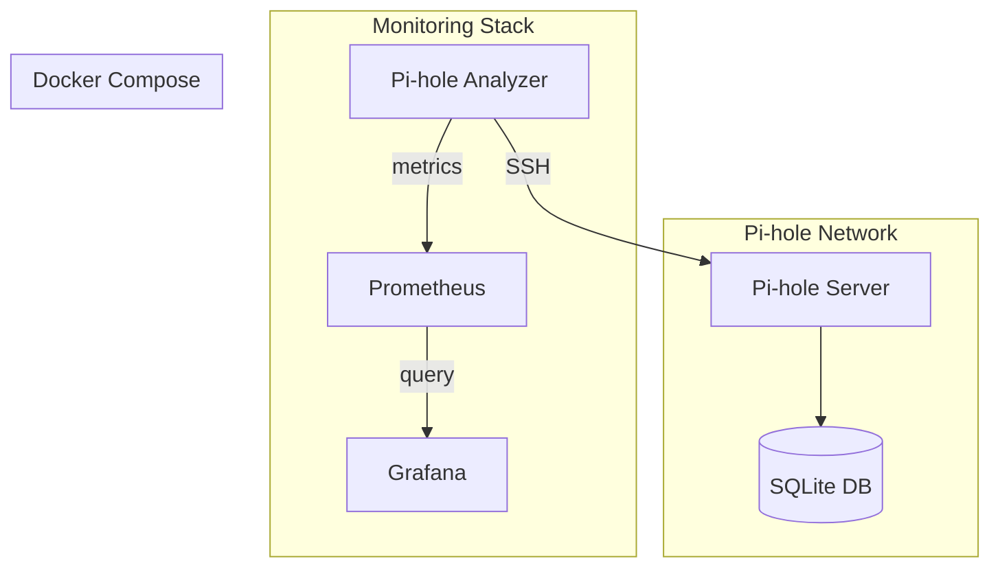

# 🗺️ Implementation Roadmap: Docker + Prometheus + Grafana

## Quick Start Implementation Plan

### 🎯 **Milestone 1: Basic Docker Support** (Week 1-2)
**Goal**: Get the application running in a Docker container

#### Essential Files to Create:
1. **`Dockerfile`** - Multi-stage build with Go and Alpine
2. **`docker-compose.yml`** - Basic container orchestration
3. **`docker/entrypoint.sh`** - Container startup script
4. **`.dockerignore`** - Optimize build context

#### Code Changes:
- Add `--server` flag for HTTP mode
- Environment variable configuration
- Graceful shutdown handling

### 🎯 **Milestone 2: Prometheus Metrics** (Week 3-4)  
**Goal**: Export DNS analytics as Prometheus metrics

#### Essential Components:
1. **HTTP Metrics Server** - `/metrics` endpoint
2. **Core Metrics** - DNS queries, clients, blocking stats
3. **Health Endpoints** - `/health` and `/ready`

#### Key Metrics to Implement:
```go
// DNS Query Metrics
pihole_dns_queries_total{client, domain, status}
pihole_dns_blocked_ratio
pihole_dns_response_time_seconds

// Client Metrics  
pihole_clients_active
pihole_client_queries_total{client, hostname}
pihole_client_last_seen_timestamp{client}

// System Metrics
pihole_analyzer_up
pihole_scrape_duration_seconds
```

### 🎯 **Milestone 3: Grafana Dashboard** (Week 5-6)
**Goal**: Beautiful visualization of Pi-hole analytics

#### Dashboard Panels:
1. **Network Overview** - Total queries, blocking effectiveness
2. **Top Clients** - Most active devices
3. **Top Domains** - Popular and blocked sites
4. **Time Series** - Query volume over time
5. **Client Map** - Device activity heatmap

### 🎯 **Milestone 4: Production Ready** (Week 7-8)
**Goal**: Complete monitoring stack deployment

#### Production Features:
- Multi-architecture Docker images
- Kubernetes Helm chart
- CI/CD pipeline integration
- Security hardening
- Performance optimization

## Technical Architecture



## Development Approach

### Phase 1: Containerization
```bash
# Create basic Docker setup
docker build -t pihole-analyzer .
docker run -p 8080:8080 pihole-analyzer --server
```

### Phase 2: Metrics Integration
```bash
# Add Prometheus client
go get github.com/prometheus/client_golang
# Implement metrics collector
# Test metrics endpoint
curl http://localhost:8080/metrics
```

### Phase 3: Dashboard Creation
```bash
# Import Grafana dashboard
# Configure Prometheus data source
# Create monitoring alerts
```

### Phase 4: Stack Deployment
```bash
# Deploy complete stack
docker-compose up -d
# Access Grafana at http://localhost:3000
```

## Quick Win Features

### 🚀 **Immediate Value** (Can implement in 1-2 days)
1. **Docker Container** - Easy deployment
2. **Basic `/metrics` endpoint** - Prometheus scraping
3. **Simple dashboard** - Visual DNS analytics

### 📊 **High Impact** (Worth the effort)
1. **Real-time metrics** - Live DNS monitoring
2. **Client tracking** - Device activity insights  
3. **Blocking analytics** - Security effectiveness
4. **Historical trends** - Long-term analysis

### 🔧 **Advanced Features** (Nice to have)
1. **Alerting** - Anomaly detection
2. **API endpoints** - Third-party integration
3. **Machine learning** - Pattern recognition
4. **Multi Pi-hole** - Distributed monitoring

## Resource Requirements

### Development Dependencies
```go
// go.mod additions
require (
    github.com/prometheus/client_golang v1.17.0
    github.com/gorilla/mux v1.8.0
    github.com/spf13/viper v1.17.0
)
```

### Infrastructure
- **Docker**: Container runtime
- **Prometheus**: Metrics storage (~100MB RAM)
- **Grafana**: Dashboard UI (~150MB RAM)
- **Total**: ~512MB RAM for monitoring stack

## Success Criteria

### ✅ **Milestone 1 Complete When:**
- Application runs in Docker container
- Can access Pi-hole data from container
- Basic configuration via environment variables

### ✅ **Milestone 2 Complete When:**
- `/metrics` endpoint returns valid Prometheus metrics
- Key DNS analytics available as metrics
- Prometheus can scrape the application

### ✅ **Milestone 3 Complete When:**
- Grafana dashboard shows DNS analytics
- Real-time data visualization
- Interactive filtering and drill-down

### ✅ **Milestone 4 Complete When:**
- Production-ready Docker images
- Complete docker-compose stack
- CI/CD pipeline builds and deploys
- Documentation and examples complete

---

**Next Step**: Start with Milestone 1 - Basic Docker containerization! 🐳
